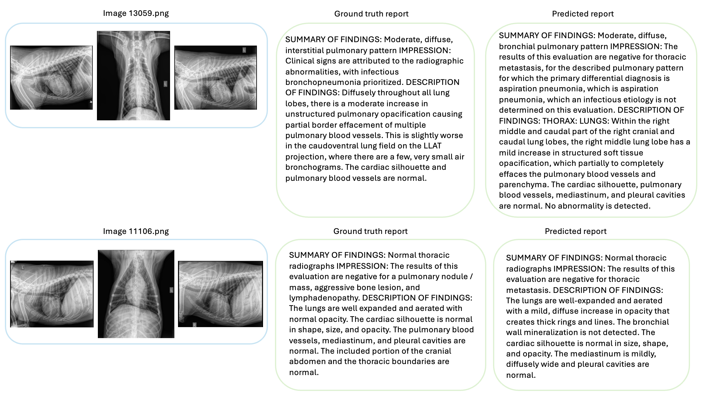
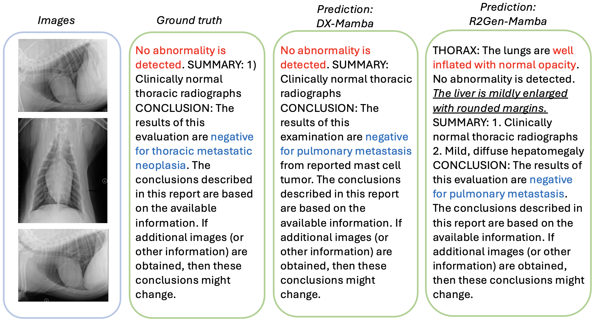

<h1 align="center">DX-Mamba: Exploring State Space Model for Dog X-ray Report Generation</h1>
<p align="center">
  
</p>


<h2>Repository for codes of the DX-Mamba paper</h2>

<p>This repository provides the coding implementation of the paper "DX-Mamba: Exploring State Space Model for Dog X-ray Report Generation".</p>

<h3>Code implementation</h3>

```python
git clone https://github.com/Anonymous-ab/DX-Mamba_resources
cd DXMamba
conda create -n DXMamba_env python=3.9
conda activate DXMamba_env
pip install -r requirements.txt
```

<h3>Data Preparation and preprocessing</h3>

<p>We propose a large-scale Dog-Xray dataset that contains 13,794 dog thoracic studies and 36,264 corresponding X-ray images. The data source is still in privacy. For more information, please contact...
  
  Below is the data structure of the Dog-Xray dataset.</p>

```python
├─/root/Data/Dog-Xray/
        ├─captions.json
        ├─captions
             ├─Train.csv
             ├─Valid.csv
             ├─Test.csv
        ├─images
             ├─Train
             ├─Valid
             ├─Test
```


```python
python Data_preprocess.py 
```

<h3>Training</h3>

```python
python train.py --network MambaVision-L-1K --train_batchsize 64
```

<h3>Test</h3>

```Python
python test.py --network MambaVision-L-1K --checkpoint ./models_ckpt/transformer_decoderlayers12024-11-08-16-40-56_1627_all/Dog-X-ray_bts_8_MambaVision-L-1K_epo_29_Bleu4_25245_test.pth
```


<h2>Experiments</h2>

<h3>Result tables</h3>

<p align="center">
  
</p>
<p align="center">Table 1: Results comparisons of different methods on the Dog-Xray dataset.</p>


<p align="center">
  
</p>
<p align="center">Table 2: Results comparisons of different methods on the IU-Xray and MIMIC-CXR datasets.</p>


<h3>Prediction sample comparisons</h3>

<p align="center">
  
</p>
<p align="center"> Figure 1: Predicted report samples on image pairs 13059 and 11106 using the DX-Mamba model.</p>


<p align="center">
  
</p>
<p align="center"> Figure 2: Predicted reports comparison on a sample image pair 12088 using DX-Mamba and R2Gen-Mamba models.</p>
