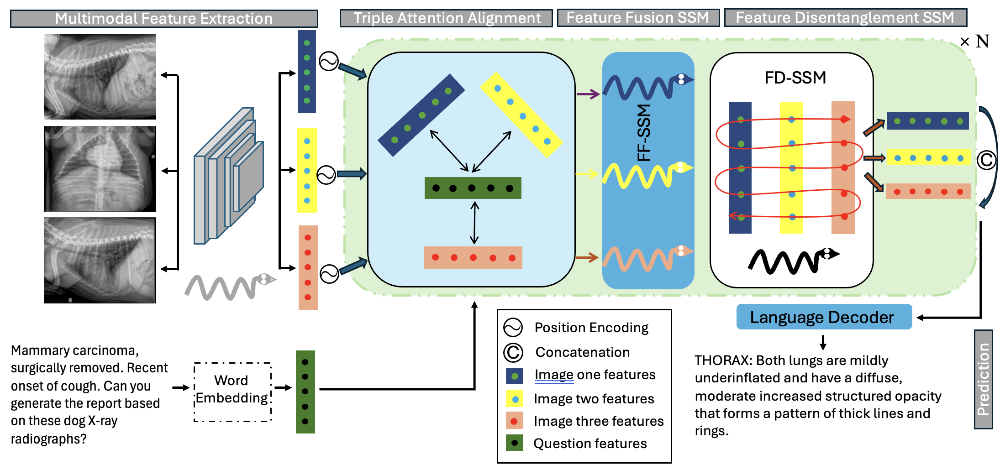

<h1 align="center">DX-Mamba: Exploring State Space Model for Dog X-ray Report Generation</h1>
<p align="center">
  
</p>
<p align="center">Workflow of the proposed DX-Mamba model</p>


<h2>Repository for codes of the DX-Mamba paper</h2>

<p>This repository provides the coding implementation of the paper "DX-Mamba: Exploring State Space Model for Dog X-ray Report Generation".</p>

<h3>Code implementation</h3>

```python
git clone https://github.com/Chen-Yang-Liu/RSCaMa.git
cd RSCaMa
conda create -n RSCaMa_env python=3.9
conda activate RSCaMa_env
pip install -r requirements.txt
