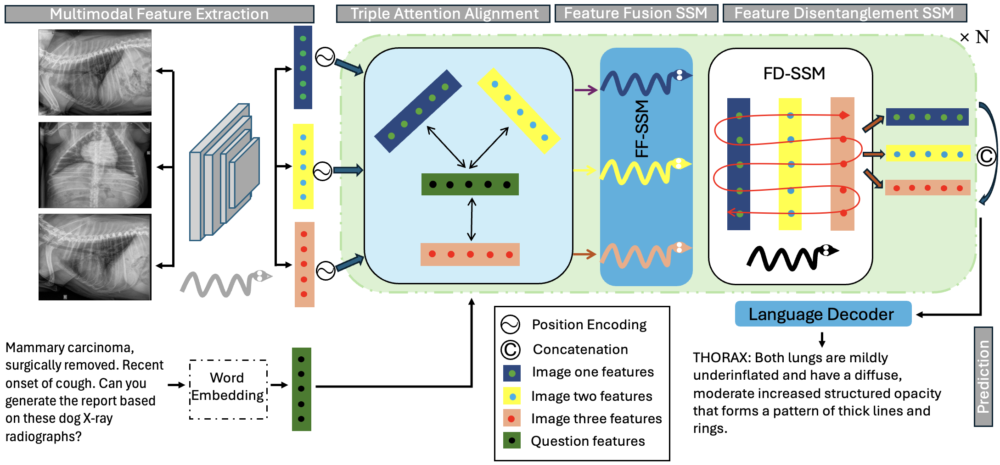

<h1 align="center">DX-Mamba: Exploring State Space Model for Dog X-ray Report Generation</h1>

<h2 style="text-align: center;">DX-Mamba and state space model (SSM) for report generation</h2>
<figure style="display: flex; flex-direction: column; align-items: center; justify-content: center; text-align: center;">
    
    <figcaption style="margin-top: 10px; font-style: italic; color: #555; text-align: center;">Figure 1: Workflow of the proposed DX-Mamba model</figcaption>
</figure>
